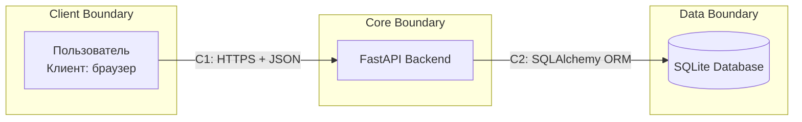
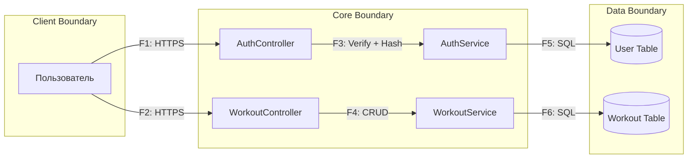
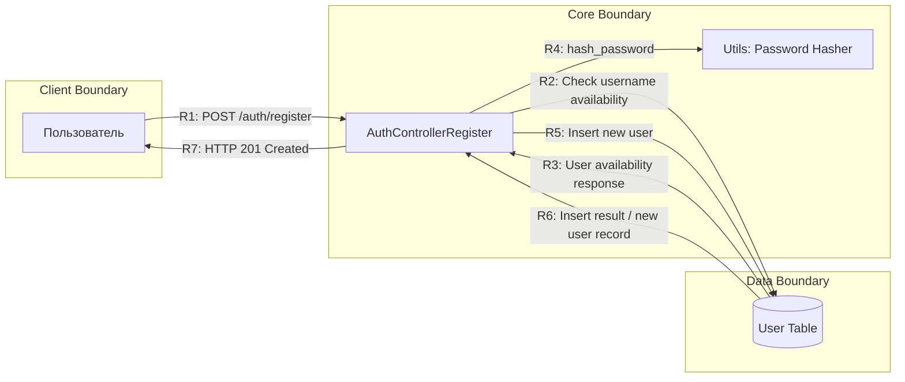
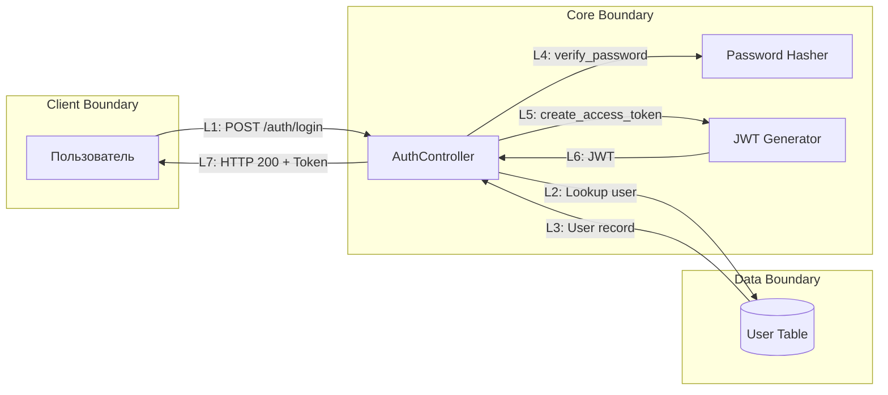
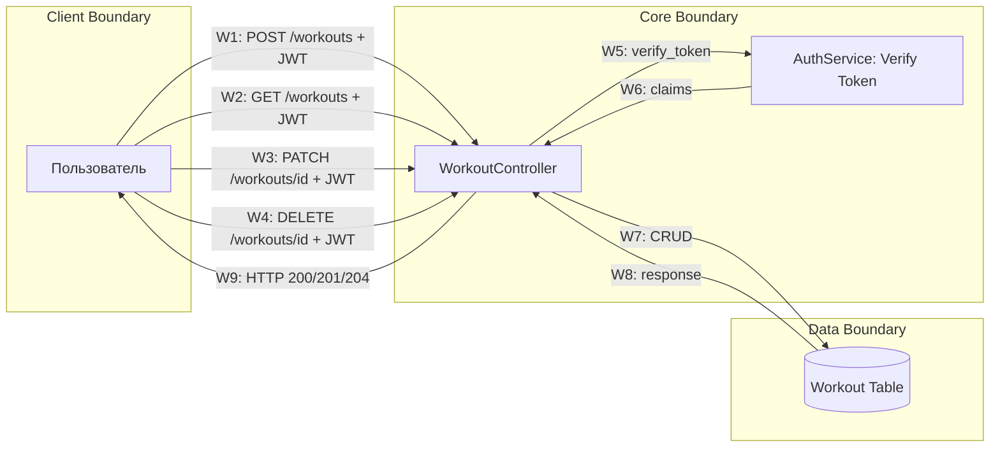

# Context DFD

```mermaid
flowchart LR
    U[Пользователь\n Клиент: браузер] -->|C1: HTTPS + JSON| API[FastAPI Backend]
    API -->|C2: SQLAlchemy ORM| DB[(SQLite Database)]

    subgraph Client [Client Boundary]
        U
    end

    subgraph Core [Core Boundary]
        API
    end

    subgraph Data [Data Boundary]
        DB
    end
```
# Logical DFD

```mermaid
flowchart LR
    U[Пользователь] -->|F1: HTTPS| AuthController
    U -->|F2: HTTPS| WorkoutController

    AuthController -->|F3: Verify + Hash| AuthService
    WorkoutController -->|F4: CRUD| WorkoutService

    AuthService -->|F5: SQL| UserRepository[(User Table)]
    WorkoutService -->|F6: SQL| WorkoutRepository[(Workout Table)]

    subgraph Client [Client Boundary]
        U
    end

    subgraph Core [Core Boundary]
        AuthController
        WorkoutController
        AuthService
        WorkoutService
    end

    subgraph Data [Data Boundary]
        UserRepository
        WorkoutRepository
    end
```
# Process DFD
# Register

```mermaid
%%{init: {"themeVariables": {"fontSize": "18px"}}}%%
flowchart LR
    U[Пользователь] -->|R1: POST /auth/register| AuthControllerRegister
    AuthControllerRegister -->|R2: Check username availability| UserRepository[(User Table)]
    UserRepository -->|R3: User availability response| AuthControllerRegister
    AuthControllerRegister -->|R4: hash_password| PasswordHasher[Utils: Password Hasher]
    AuthControllerRegister -->|R5: Insert new user| UserRepository
    UserRepository -->|R6: Insert result / new user record| AuthControllerRegister
    AuthControllerRegister -->|R7: HTTP 201 Created| U

    subgraph Client [Client Boundary]
        U
    end

    subgraph Core [Core Boundary]
        AuthControllerRegister
        PasswordHasher
    end

    subgraph Data [Data Boundary]
        UserRepository
    end
```
# Login

```mermaid
flowchart LR
    U[Пользователь] -->|L1: POST /auth/login| AuthController
    AuthController -->|L2: Lookup user| UserRepository[(User Table)]
    UserRepository -->|L3: User record| AuthController
    AuthController -->|L4: verify_password| Utils[Password Hasher]
    AuthController -->|L5: create_access_token| AuthService[JWT Generator]
    AuthService -->|L6: JWT| AuthController
    AuthController -->|L7: HTTP 200 + Token| U

    subgraph Client [Client Boundary]
        U
    end

    subgraph Core [Core Boundary]
        AuthController
        Utils
        AuthService
    end

    subgraph Data [Data Boundary]
        UserRepository
    end
```
# Workout CRUD

```mermaid
%%{init: {"themeVariables": {"fontSize": "18px"}}}%%
flowchart LR
    U[Пользователь] -->|W1: POST /workouts + JWT| WorkoutController
    U -->|W2: GET /workouts + JWT| WorkoutController
    U -->|W3: PATCH /workouts/id + JWT| WorkoutController
    U -->|W4: DELETE /workouts/id + JWT| WorkoutController
    WorkoutController -->|W5: verify_token| JWTService[AuthService: Verify Token]
    JWTService -->|W6: claims| WorkoutController
    WorkoutController -->|W7: CRUD| WorkoutRepository[(Workout Table)]
    WorkoutRepository -->|W8: response| WorkoutController
    WorkoutController -->|W9: HTTP 200/201/204| U

    subgraph Client [Client Boundary]
        U
    end

    subgraph Core [Core Boundary]
        WorkoutController
        JWTService
    end

    subgraph Data [Data Boundary]
        WorkoutRepository
    end
```
